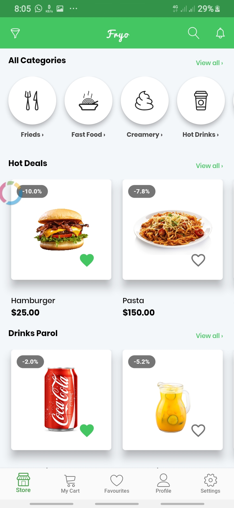
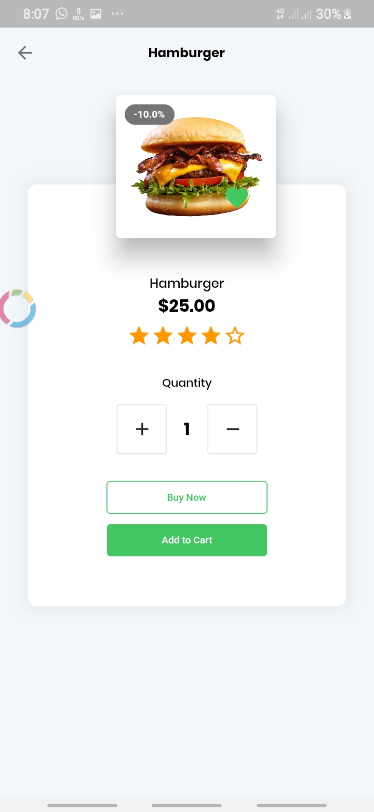
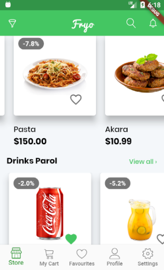

An e-billing system is used by companies to provide a facile interface for their clients and customers to pay bills. This system collects information from a client and facilitates payment. Problems with existing systems include their inability to modify data effectively and efficiently, lack of user-friendly interface for retrieval and storing of data, difficulty in generating reports, and high dependence on paper records which can be risky. The ‘Bill Information and Management System’ (BiMS) app aims to provide a solution to billing software that deals with these problems.

| 3|
|-------|
||

| 4 | 5|
|------|-------|
|||

ER-Diagram
Database tables 
and other info can be found here:
https://drive.google.com/open?id=137E1OgJzuBQVdcmaKcQxg4fALB75bAOU43OK9kqvYBc

